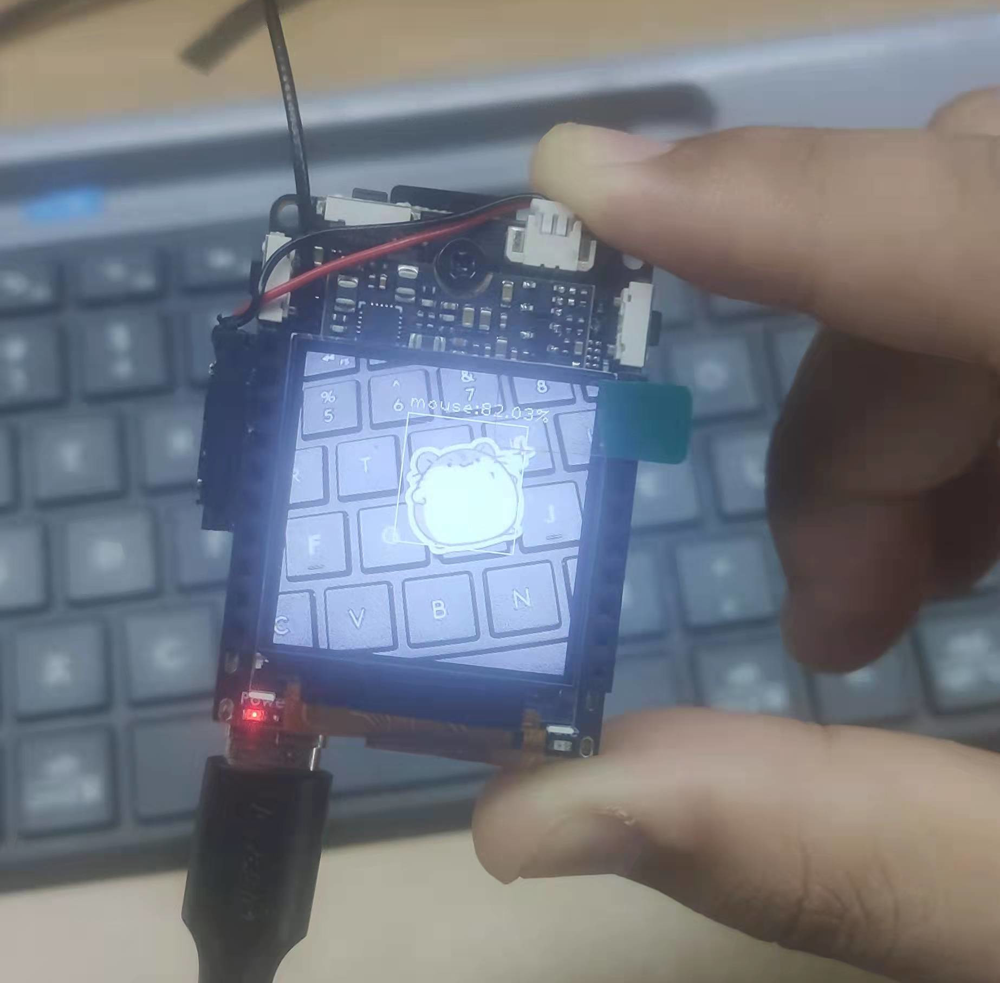

# 这是用于训练 v831 检测模型的仓库

> 本文当目前针对 V831 系列产品，请注意产品与模型的匹配性。

## 训练环境搭建

由于训练需要用到显卡，关于安装显卡驱动、cuda、udnn、opencv 请自行百度查阅安装，本文不做详细说明。本文章是在 ubuntu 环境下，使用英伟达 GTX1080 显卡所编写完成的，请以该环境为参考。

需要安装的软件包介绍：

pytorch ：基础训练框架。

onnx2ncnn ：模型转换工具。

torchsummary ： 格式化打印模型信息。

文章参考：

* 显卡驱动安装：https://neucrack.com/p/252
* opencv 多版本共存：https://neucrack.com/p/349

1、  安装pytorch 、torchsummary

打开 [pytorch](https://pytorch.org/) 官网，点击 [Get Started](https://pytorch.org/get-started/locally/) 进入到下载页面！选择对应pytorch进行下载！

此处安装的是 gpu 版本的 pytorch 。

~~~ bash
pip3 install torch torchvision torchaudio  

pip3 install torchsummary 

pip3 install pycocotools

~~~

2、 编译 onnx2ncnn 工具

 工具 github 地址：https://github.com/Tencent/ncnn.git  

 安装过程 ：
~~~ bash
#!/bin/bash

sudo apt install build-essential git cmake libprotobuf-dev protobuf-compiler libvulkan-dev vulkan-utils libopencv-dev

git clone https://github.com/Tencent/ncnn.git

cd ncnn

git submodule update --init

mkdir build

cd build

cmake -DCMAKE_BUILD_TYPE=Release -DNCNN_VULKAN=ON -DNCNN_SYSTEM_GLSLANG=OFF -DNCNN_BUILD_EXAMPLES=ON ..

make
~~~

编译完后你就得到了 ncnn 的模型转换工具。

在 ncnn/build/tools/onnx 目录下，能得到 **onnx2ncnn** 模型转换工具，将该可执行文件加入到环境变量中方便使用。

在 ~/.bashrc 中添加下面内容，将 **onnx2ncnn** 加入环境变量：
~~~
#!/bin/bash

export PATH=$PATH:`pwd`/tools/onnx
~~~

## 图像检测

图像检测主要采用的模型是 YOLOv2 ，由 pytorch 架构训练完成，经由网络模型转换后部署到 v831 上。  

### 数据集准备  

YOLOv2 默认使用 voc 格式的数据集,文件夹取名为 custom 放到 data 目录下, 比如:
~~~ bash
#voc格式的yolo训练数据集
├── custom    #数据集文件夹名
│   ├── Annotations		#标注文件
│   ├── ImageSets		#训练参数划分
│   │    └── Main
│   │         ├── train.txt
│   │         └── val.txt
│   ├── JPEGImages		#训练图片
~~~

train.txt 和 val.txt 中, 没一行是一个数据(图像)名, 路径相对于 `JPEGImages`
~~~ bash
train.txt 写着用于训练的图片名称
val.txt  写着用于验证的图片名称
~~~
\* 修改配置

修改 `data/custom.py` 中的 `CUSTOM_CLASSES` 变量为正确的 `labels`
~~~ python
CUSTOM_CLASSES = [
    "mouse",
    "sipeed_logo"
]
~~~

### 使用显卡训练

~~~ bash
python train.py -d custom --cuda -v slim_yolo_v2 -hr -ms 

# -d custom               使用 custom 数据集  
# --cuda                  使用英伟达显卡训练(如果使用 CPU 训练则需要去掉该参数)  
# -v slim_yolo_v2         使用 slim_yolo_v2 检测模型 

~~~

[//]: # "如果使用在 windows 下训练 请使用下面命令:"
[//]: # "python train.py -d custom --cuda -v slim_yolo_v2 -hr -ms --num_workers 0"
[//]: # "--num_workers 运行线程数"
[//]: # "或者安装好horovod, 然后多卡训练"
[//]: # "~~~ bash"
[//]: # "horovodrun -np 4 python train.py -d custom --cuda -v slim_yolo_v2 -hr -ms"
[//]: # "~~~"

训练完成后会在 weights/custom/slim_yolo_v2 目录下生成训练中保存的参数

### 导出模型

~~~ bash
python test.py -d custom -v slim_yolo_v2 --trained_model weights/custom/slim_yolo_v2/slim_yolo_v2_1000.pth --visual_threshold 0.3 -size 224 --export

# -d custom                                                               使用 custom 数据集  
# -v slim_yolo_v2                                                         使用 slim_yolo_v2 检测模型  
# --trained_model weights/custom/slim_yolo_v2/slim_yolo_v2_1000.pth       使用第 1000 次训练的模型参数(有经验者可以自行更换)  
# --visual_threshold 0.3                                                  检测阈值设定为 0.3  
# -size 224                                                               图片尺寸为 224 X 224  
# --export                                                                测试完图片后导出 oxnn 模型(不加此选项需要手动将 pytorch 模型转成 oxnn 模型)  
~~~

运行导出模型命令后会在 out 目录下生成 test 测试图片效果和模型文件,模型转换请参考上面模型转换章节.

### 模型转换  

在线转换需要上传一个压缩包文件.  
- 该功能只能支持上传一个无密码的 zip 压缩包  
- 压缩包内需要包含一个 images 目录，一个 xxx.bin，一个 xxx.param  
- 需要将矫正图片放入 images 目录内；矫正图片集可考虑直接采用训练中的验证数据集，并务必保证矫正时图像的预处理方式与训练和部署时一致。  
> 注意：确保 images 目录内没有混入其他文件，否则会导致模型量化错误。

zip 压缩包目录结构
~~~ bash
└─xxxx.zip
    |─ images
    |    |- xxx.jpg
    |    |- ...
    |    ...
    |
    |- xxx.bin
    └─ xxx.param
~~~

制作好压缩包后打开网址: [https://maixhub.com/modelConvert](https://maixhub.com/modelConvert) 查看使用说明。  

  

登陆后,上传你的压缩包等待模型转换任务完成。    

### 模型部署  
等待模型转换完成,下载转换好的模型文件.  
得到的 *.param 和 *.bin 文件就是部署在 v831 上的文件.  
打开事例代码,替换模型文件名,分类标签和模型加载参数,然后运行即可. 
~~~ python
#检测示例代码

from maix import nn, camera, image, display
from maix.nn import decoder
import time

model = {
    "param": "/root/yolov2_int8.param",
    "bin": "/root/yolov2_int8.bin"
}
options = {
    "model_type":  "awnn",
    "inputs": {
        "input0": (224, 224, 3)
    },
    "outputs": {
        "output0": (7, 7, (1+4+2)*5)    #输出参数修改,修改格式 (7 ,7 , (1 + 4 + "类别数量" ) * 5)
    },
    "mean": [127.5, 127.5, 127.5],
    "norm": [0.0078125, 0.0078125, 0.0078125],
}

labels = ["mouse","sipeed_logo"]            #分类标签
anchors = [1.19, 1.98, 2.79, 4.59, 4.53, 8.92, 8.06, 5.29, 10.32, 10.65]

m = nn.load(model, opt=options)
yolo2_decoder = decoder.Yolo2(len(labels), anchors, net_in_size=(options["inputs"]["input0"][0], options["inputs"]["input0"][1]), net_out_size=(7, 7))

while True:
    img = camera.capture()
    AI_img = img.copy().resize(224, 224)
    out = m.forward(AI_img.tobytes(), quantize=True, layout="hwc")
    boxes, probs = yolo2_decoder.run(out, nms=0.3, threshold=0.3, img_size=(options["inputs"]["input0"][0], options["inputs"]["input0"][1]))

    if len(boxes):
        for i, box in enumerate(boxes):
            class_id = probs[i][0]
            prob = probs[i][1][class_id]
            disp_str = "{}:{:.2f}%".format(labels[class_id], prob*100)
            img.draw_rectangle(box[0], box[1], box[0] + box[2], box[1] + box[3], color = (255, 255, 255))
            x = box[0]
            y = box[1] - 20
            if y < 0:
                y = 0
            img.draw_string(x, y, disp_str, color = (255, 255, 255))

    display.show(img)

~~~

运行效果图:

检测说明到此结束.

### 问题与解决

出现训练错误时，请检查数据集是否有问题。

清理 YOLO/data/custom 中的缓存数据，再次尝试运行。